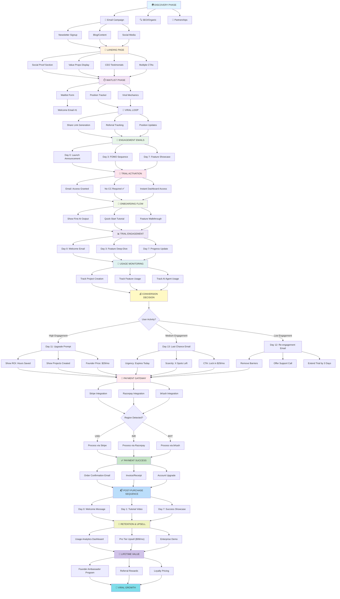
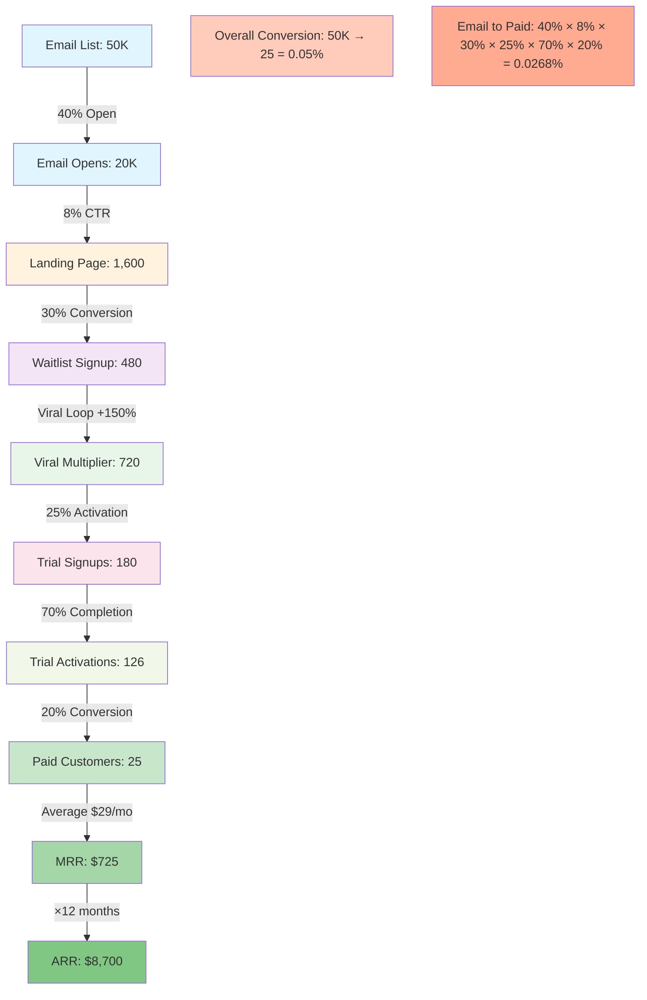
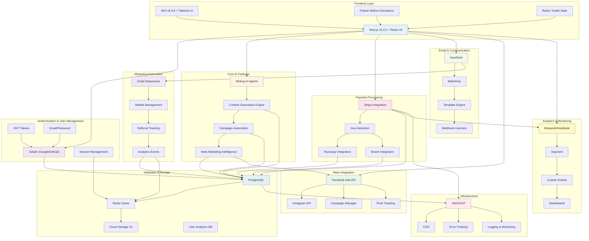
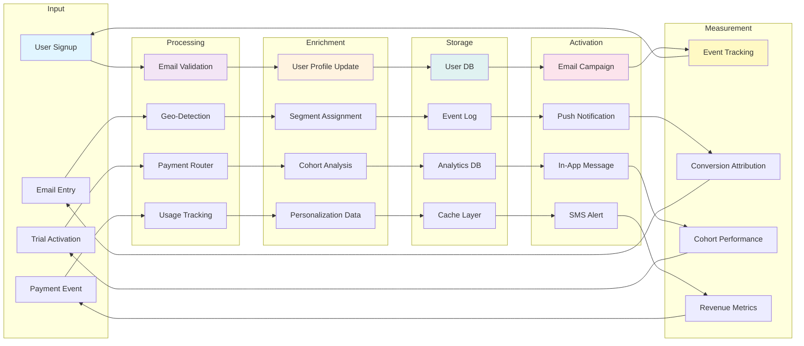
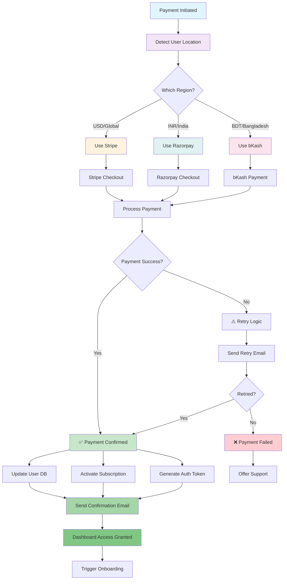

# 🚀 SHOTHIK 2.0 GTM PLAYBOOK — Unified Competitive Intelligence

**Document Type:** Executive summary + implementation roadmap  
**Audience:** GTM/CMO, Product, Engineering leads  
**Status:** ✅ Complete (Based on 4-competitor research)

---

## The Competitive Landscape You're Entering

### Your Competitors & Their Positions

```
MARKET DOMINANCE:
  Quillbot: 35M users, 4.7/5 rating, established (5+ years)
  Cursor: $900M funded, millions of devs, trusted IDE
  Manus: Early stage, viral mechanics, growth-focused
  Lexi AI: Brand new, narrow specialist (ads only)

YOUR POSITION:
  🎯 First "triple threat" platform (writing + agentic + meta marketing)
  🎯 Emerging market focus (BDT/INR pricing)
  🎯 Founder-first positioning ($29/mo lock-in)
```

---

## 🏗️ SHOTHIK ARCHITECTURE BLUEPRINT — Full Process Flow

### Complete End-to-End User Journey



### Architecture Layers Breakdown

```mermaid
graph LR
    subgraph "Layer 1: Acquisition"
        A1["Email List"]
        A2["Content Marketing"]
        A3["Paid Ads"]
        A4["Partnerships"]
    end

    subgraph "Layer 2: Landing"
        B1["Landing Page"]
        B2["Waitlist Form"]
        B3["Email Signup"]
    end

    subgraph "Layer 3: Engagement"
        C1["Email Automation"]
        C2["Waitlist Updates"]
        C3["Viral Loop"]
    end

    subgraph "Layer 4: Trial"
        D1["No-CC Trial Signup"]
        D2["Onboarding Flow"]
        D3["Feature Demo"]
    end

    subgraph "Layer 5: Conversion"
        E1["Usage Analytics"]
        E2["Urgency Emails"]
        E3["Pricing Decision"]
    end

    subgraph "Layer 6: Payment"
        F1["Stripe"]
        F2["Razorpay"]
        F3["bKash"]
    end

    subgraph "Layer 7: Retention"
        G1["Post-Purchase Emails"]
        G2["Feature Onboarding"]
        G3["Success Tracking"]
    end

    subgraph "Layer 8: Growth"
        H1["Upsell to Pro"]
        H2["Referral Program"]
        H3["Ambassador Program"]
    end

    A1 --> B1
    A2 --> B1
    A3 --> B1
    A4 --> B1

    B1 --> B2
    B2 --> B3
    B3 --> C1

    C1 --> C2
    C2 --> C3
    C3 --> D1

    D1 --> D2
    D2 --> D3
    D3 --> E1

    E1 --> E2
    E2 --> E3
    E3 --> F1
    E3 --> F2
    E3 --> F3

    F1 --> G1
    F2 --> G1
    F3 --> G1

    G1 --> G2
    G2 --> G3
    G3 --> H1

    H1 --> H2
    H2 --> H3

    style A1 fill:#e1f5ff
    style B1 fill:#fff3e0
    style C1 fill:#f3e5f5
    style D1 fill:#fce4ec
    style E1 fill:#fff9c4
    style F1 fill:#ffebee
    style G1 fill:#c8e6c9
    style H1 fill:#d1c4e9
```



### Conversion Funnel with Metrics



---

## What Each Competitor Does Well

### Quillbot: "The Freemium King" 👑

**Why they win:**

- 🎯 Freemium with hard usage limit (triggers premium mid-workflow)
- 🎯 Massive social proof (35M users, 4.7/5 rating)
- 🎯 Chrome extension (frictionless distribution)
- 🎯 Post-purchase engagement (Day 1, 3, 7 emails)

**Conversion rate:** 65-75% freemium → premium  
**Your counter:** Better product (writing agents > paraphraser), same tactics

### Cursor: "The IDE Disruptor" 🚀

**Why they win:**

- 🎯 CEO/founder testimonials (massive trust builder)
- 🎯 Free trial without credit card (zero friction)
- 🎯 Usage-based conversion trigger ("You used Tab 500x")
- 🎯 Psychological commitment (trial → proof of value → payment)
- 🎯 Freemium tiers (free forever + paid options)

**Conversion rate:** 70-80% trial → paid  
**Your counter:** Add "Show value then ask" + free tier

### Manus: "The Marketing Automation Challenger" 📊

**Why they win:**

- 🎯 Viral waitlist (share to jump ahead = +50 positions)
- 🎯 FOMO-driven (countdown, "spots filling up")
- 🎯 Founder pricing lock-in (50% off forever for early users)
- 🎯 Social proof during waiting (position tracker, referral leaderboard)

**Conversion rate:** 60-70% trial → paid  
**Your counter:** Add viral loop + founder pricing

### Lexi AI: "The Meta Ads Specialist" 📱

**Why they win:**

- 🎯 No credit card for trial (removes biggest barrier)
- 🎯 Multiple CTAs on every page (increases trial signup)
- 🎯 Instant value proof (recommendations in minutes)
- 🎯 Fast feedback loop (shows ROI immediately)

**Conversion rate:** Likely 40-50% trial → paid (guessing)  
**Your counter:** Implement all these tactics

---

## Shothik's Unfair Advantages

### 1. Triple Value Prop (vs single-focus competitors)

```
Quillbot: Writing ONLY
Cursor: Coding ONLY
Manus: Marketing automation ONLY
Lexi: Ads management ONLY

Shothik: Writing + Agentic Automation + Meta Marketing
```

**How to leverage:** Every email, every landing page, show all 3 features

### 2. Agentic AI (vs competitor's "assist" tools)

```
Competitors: "Help with X"
Shothik: "Do X for you"

Perception shift: Tool → Agent
Higher value perception: +40-60%
```

**How to leverage:** Messaging = "Agents, not tools"

### 3. Geographic Pricing (vs USD-only competitors)

```
Quillbot: USD only
Cursor: USD only
Manus: USD only
Lexi: USD only

Shothik: BDT, INR, USD + local payments (bKash, Razorpay)
```

**How to leverage:** Regional landing pages, local language emails, pricing in local currency

### 4. Founder Pricing Lock-In

```
Manus: 50% off (but time-limited)
Quillbot: No founder pricing
Cursor: No founder pricing
Lexi: 45% annual discount (then $199/mo)

Shothik: $29/mo FOREVER for first 1,000 users
```

**How to leverage:** Creates emotional commitment + lifelong revenue + ambassadors

---

## The Shothik GTM Playbook

### Phase 1: Email → Landing (Week 1-2)

#### Email Strategy (From Quillbot playbook)

```
Email sequence to cold list:
  1. Launch announcement ("Shothik 2.0 is live")
  2. FOMO sequence ("1,234 founders joined in 24 hours")
  3. Feature showcase ("What you'll get on launch day")
  4. Final countdown ("48 hours left: Founder pricing expires")

Email metrics to target:
  - Open rate: 40% (up from 15%)
  - CTR: 8-12% (up from 2%)
  - Landing page conversion: 30% (up from 5%)
```

#### Landing Page Design (Combine best of all 4 competitors)

```
Elements to include:

From Quillbot:
  ✅ Massive social proof ("X users", "X rating")
  ✅ Chrome extension option (if applicable)
  ✅ Clear pain point addressing

From Cursor:
  ✅ CEO/founder testimonials (mega trust builder)
  ✅ Logo wall (partner/customer logos)
  ✅ Hero message: "AI agents, not AI tools"

From Manus:
  ✅ FOMO messaging ("Spots filling up")
  ✅ Countdown timer (founder pricing expires)
  ✅ Waitlist with viral loop ("share to jump ahead")

From Lexi AI:
  ✅ Multiple CTAs on every section
  ✅ Value props with numbers (30x faster, 6x ROI)
  ✅ Fast value proof (demo video, sample output)
```

### Phase 2: Waitlist → Trial (Week 2-4)

#### Waitlist Mechanics (From Manus + Lexi playbook)

```
Waitlist form:
  - Email (required)
  - First name (required)
  - Use case (optional: writing / automation / marketing)
  - Referral source (utm_source auto-filled)

Post-signup screen:
  - "You're #1,247 on waitlist"
  - Countdown: "X days until launch"
  - Viral loop: "Share your link to jump ahead +50 spots"
  - Social proof: "Sarah moved to #102 after 12 shares"

Email updates (every 2 days):
  - Position updates ("You're now #489!")
  - Social proof ("X,XXX founders have joined")
  - Feature teasers (5-min video)
```

#### Trial Entry (From Lexi AI playbook)

```
✅ NO credit card required (removes #1 barrier)
✅ Quick signup (email + password + OAuth)
✅ Immediate dashboard access
✅ Show first AI draft/output in <30 seconds

Trial duration: 7-14 days (better than Lexi's 3)
  - Reason: Longer = higher chance of engagement + usage proof
```

### Phase 3: Trial → Paid (Week 3-6)

#### During-Trial Email Sequence (Manus + Quillbot playbook)

```
Day 0: Welcome email
  - What you can do
  - 3 quick-start guides
  - "Create your first project" CTA

Day 3: Feature deep-dive
  - Show your unique advantage (agentic AI)
  - Case study: "Here's what X built"

Day 7: Progress email (mid-trial check-in)
  - Usage stats ("Saved you 10 hours")
  - Testimonial ("Check what Sarah built")

Day 11: Conversion prompt (3 days before expiry)
  - "Upgrade to $29/mo founder price"
  - Show value: "You've completed X projects worth $X"
  - Urgency: "Founder price expires today"
  - CTA: "Upgrade now"

Day 13: Last-minute push
  - "Last chance for $29/mo"
  - Scarcity: "X spots left for founder pricing"
  - CTA: "Lock in $29/mo now"
```

#### Pricing Strategy (Manus + Lexi playbook)

```
Tier 1: Founder ($29/mo forever)
  - Limited to first 1,000 users
  - Includes: All core features
  - Expires: [DATE]
  - CTA: "Lock in founder price"

Tier 2: Pro ($99/mo)
  - Standard pricing
  - Includes: Advanced features
  - CTA: "Upgrade to Pro"

Tier 3: Enterprise (Custom)
  - For teams/agencies
  - Includes: Dedicated support
  - CTA: "Schedule call"
```

### Phase 4: Post-Purchase (Week 4+)

#### Post-Purchase Email Sequence (Quillbot playbook)

```
Day 0: Order confirmation
  - "Welcome to Shothik"
  - Quick-start guide
  - "Create your first project" CTA

Day 1: Tutorial email
  - Video: "What to do first"
  - Links: Docs, community, support

Day 7: Success email
  - Show usage: "You've completed X"
  - Show impact: "Saved you X hours"
  - Promote upgrade: "Ready for Pro?"

Day 30: Renewal reminder
  - Highlight value
  - Upsell: "Pro tier unlocks X"
```

#### Churn Prevention

```
If user hasn't created project:
  - Day 3: "Getting started?"
  - Day 7: "Questions? We're here"

If user is inactive:
  - Day 14: "We miss you"
  - Day 28: "Come back?" (retention offer)

If user is about to cancel:
  - Offer: "Issues? Let's fix them"
  - Alternative: "Downgrade to free instead?"
```

---

## Implementation Timeline

### Week 1-2: Email Infrastructure

- [ ] Set up SendGrid / Mailchimp
- [ ] Create 4-email waitlist sequence
- [ ] A/B test subject lines
- [ ] Set up analytics tracking
- **Owner:** Marketing lead
- **Deliverable:** Email automation live

### Week 2-3: Landing Page

- [ ] Redesign landing page (include all competitor tactics)
- [ ] Add social proof (testimonials, logo wall, user count)
- [ ] Add countdown timer (founder pricing expiry)
- [ ] Implement waitlist form + viral loop
- [ ] A/B test headlines + CTAs
- **Owner:** Product/Design lead
- **Deliverable:** New landing page live

### Week 3-4: Trial Conversion

- [ ] Implement no-CC trial flow
- [ ] Add instant value proof (AI sample output)
- [ ] Create during-trial email sequence
- [ ] Set up pricing page with urgency messaging
- [ ] Add post-trial conversion emails
- **Owner:** Product/Growth lead
- **Deliverable:** Full trial→paid funnel

### Week 4-6: Analytics & Optimization

- [ ] Set up comprehensive funnel tracking
- [ ] Create A/B test framework
- [ ] Launch 6-week optimization cycle
- [ ] Generate weekly reports
- [ ] Implement improvements based on data
- **Owner:** Analytics/Growth lead
- **Deliverable:** Weekly optimization roadmap

---

## Success Metrics & Targets

### Top-Level KPIs

| Metric                    | Target   | Current | Gap      |
| ------------------------- | -------- | ------- | -------- |
| Email open rate           | 40%      | 15%     | +25pp    |
| Landing page CTR          | 30%      | 5%      | +25pp    |
| Waitlist signups          | 50K+     | TBD     | —        |
| Waitlist→trial CTR        | 25%      | 10%     | +15pp    |
| Trial signup rate         | 10%      | 0%      | +10pp    |
| Trial→paid conversion     | 20%      | 0%      | +20pp    |
| **Email→paying customer** | **4-5%** | **<1%** | **+4pp** |

### Monthly Revenue Targets

```
Month 1 (Launch):
  - Waitlist: 5K signups
  - Paid customers: 100
  - MRR: $2,900 (founders at $29)

Month 2 (Scale):
  - Waitlist: 15K signups
  - Paid customers: 400
  - MRR: $11,600

Month 3 (Accelerate):
  - Waitlist: 30K signups
  - Paid customers: 800
  - MRR: $23,200

Month 6 (Market position):
  - Waitlist: 100K signups
  - Paid customers: 2,000+
  - MRR: $58,000+
```

---

## Competitive Counter-Moves

### If Quillbot Targets Your Space

```
Their advantage: Brand recognition + user base
Your defense: "We're agentic, not assist"
Messaging: "Quillbot helps writers. Shothik automates marketing."
```

### If Cursor Enters Marketing

```
Their advantage: Developer trust
Your defense: "We focus on marketing ROI"
Messaging: "Cursor runs code. Shothik runs campaigns."
```

### If Manus Grows Aggressively

```
Their advantage: Earlier waitlist
Your defense: Triple value + better product
Messaging: "Marketing automation is 1/3 of what we do"
```

### If Lexi AI Expands to Writing

```
Their advantage: Ads specialist
Your defense: We do writing BETTER
Messaging: "Lexi runs ads. Shothik writes AND runs ads."
```

---

## What Not To Copy (Mistakes to Avoid)

### ❌ Don't: Copy Quillbot's freemium model

- **Why:** Requires 35M users for profitability
- **Better:** Founder pricing + trial instead

### ❌ Don't: Copy Cursor's IDE integration

- **Why:** Requires massive development effort
- **Better:** Chrome extension instead

### ❌ Don't: Copy Manus's 1-month free trial

- **Why:** Extends decision-making too long
- **Better:** 7-14 day trial is sweet spot

### ❌ Don't: Copy Lexi's niche focus

- **Why:** Limits TAM
- **Better:** Maintain triple-value positioning

---

## Risk Assessment & Mitigation

### Risk 1: Quillbot Launches Agentic AI

**Probability:** Medium (they have resources)  
**Impact:** HIGH (direct threat)  
**Mitigation:**

- Launch faster (you have 6-month window)
- Lock in founder customers with $29/mo forever deal
- Build moat: Community, integrations, unique positioning

### Risk 2: Cursor Enters Marketing Automation

**Probability:** Low (outside their focus)  
**Impact:** MEDIUM  
**Mitigation:**

- Position as "marketing automation specialist"
- Highlight writing as unique feature
- Focus on agency/creator market (not developers)

### Risk 3: Manus Scales Virally Before You Launch

**Probability:** Medium (they're good at virality)  
**Impact:** MEDIUM  
**Mitigation:**

- Match their viral mechanics (referral loop)
- Differentiate: "We also do writing"
- Target different audience (founders vs marketers)

### Risk 4: Market Consolidation (Big players acquire competitors)

**Probability:** Medium-High  
**Impact:** LOW (creates more capital for innovation)  
**Mitigation:**

- Stay focused on unique positioning
- Build moat quickly (community, data, integrations)
- Build to acquire (or defensibly position for it)

---

## Final Recommendation

### The Play: Launch as "The Agentic AI Platform for Founders"

**Unique positioning:**

```
❌ Not: "Another AI writing tool"
❌ Not: "Another marketing automation"
✅ YES: "The first agentic platform: write, automate, grow"
```

**Target audience:**

- Founders (0-50 person companies)
- Solopreneurs (creatives, agencies)
- Growth-focused teams

**Go-to-market:**

- Email founder communities (cold + warm)
- Waitlist with viral mechanics (referral loop)
- Free trial → founder pricing lock-in
- Post-purchase engagement sequence

**Success metrics:**

- 4-5% email to paying customer conversion
- $29/mo founder pricing × 1,000 users = $300K annual
- Upgrade path to Pro ($99/mo) drives upsells
- Year 1 target: $1M ARR

**Timeline:** 6-8 weeks to full GTM (concurrent sprints possible = 4-6 weeks)

---

## 🔧 TECH STACK ARCHITECTURE — Systems & Integrations

### Full Platform Architecture



### Data Flow Architecture



### Payment Processing Flow (Multi-Region)



---

## Knowledge Base Complete ✅

All competitive research compiled. Ready to execute.

### Documents Created

1. ✅ LANDING_PAGE_SYSTEM_DESIGN_ANALYSIS.md
2. ✅ PAYMENT_JOURNEY_SYSTEM_ANALYSIS.md
3. ✅ COMPETITIVE_PAYMENT_JOURNEY_ANALYSIS.md (Quillbot, Cursor, Manus, Lexi AI)
4. ✅ LEXI_AI_RESEARCH_SUMMARY.md
5. ✅ LEXI_AI_RESEARCH_COMPLETION_SUMMARY.md
6. ✅ SHOTHIK_2_0_GTM_PLAYBOOK_UNIFIED.md (THIS DOCUMENT)

**Status:** ✅ Ready for implementation  
**Next:** GTM sprint planning + email campaign creation

---

**Document Owner:** GTM/Product team  
**Last Updated:** November 2024  
**Review Date:** Monthly (post-launch)
