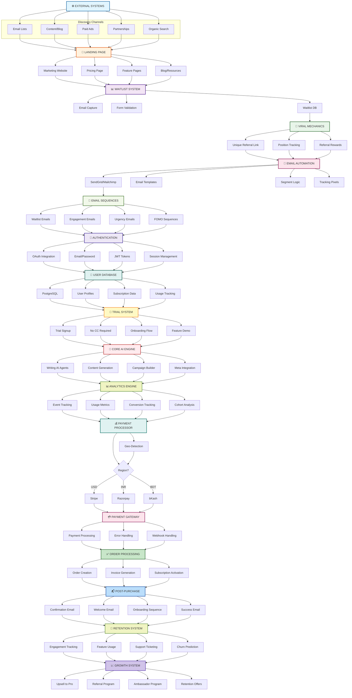
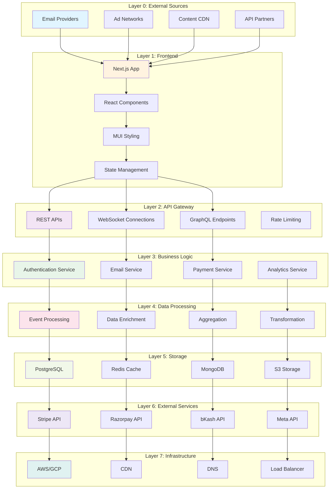
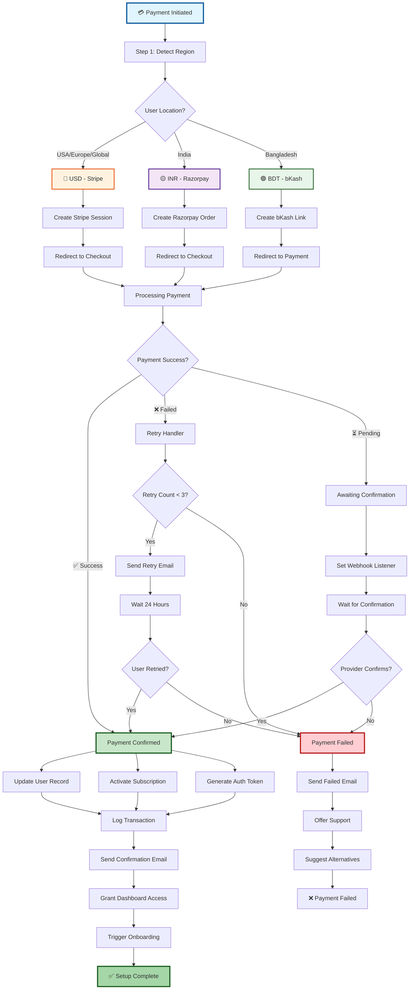
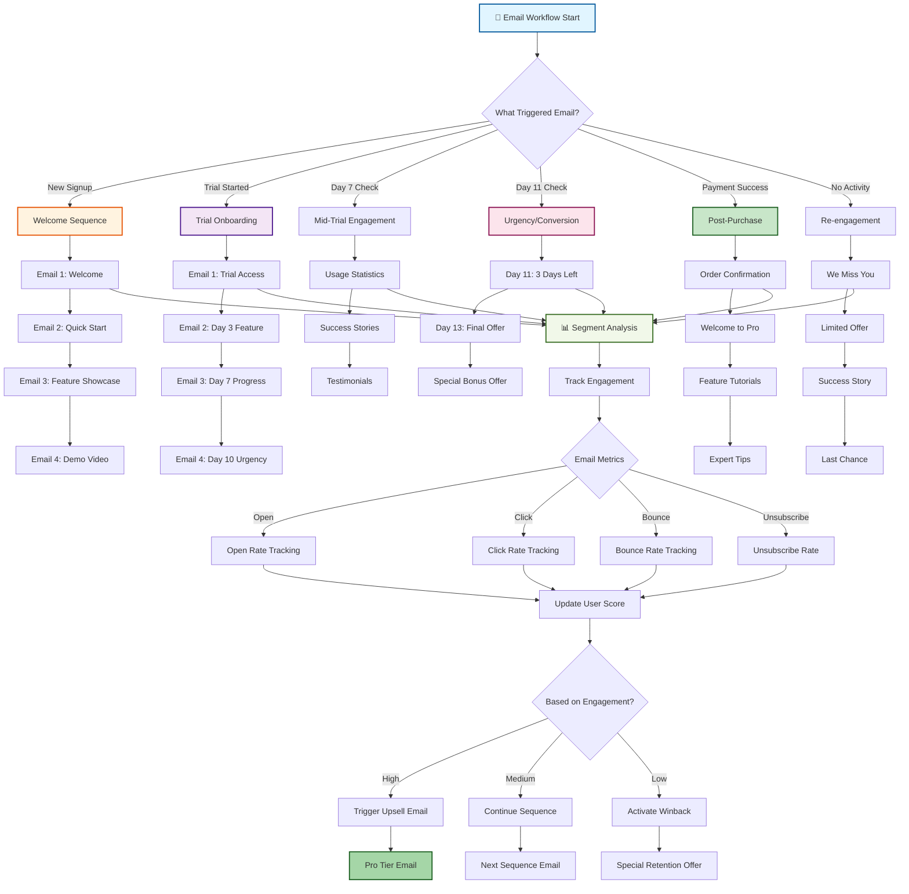
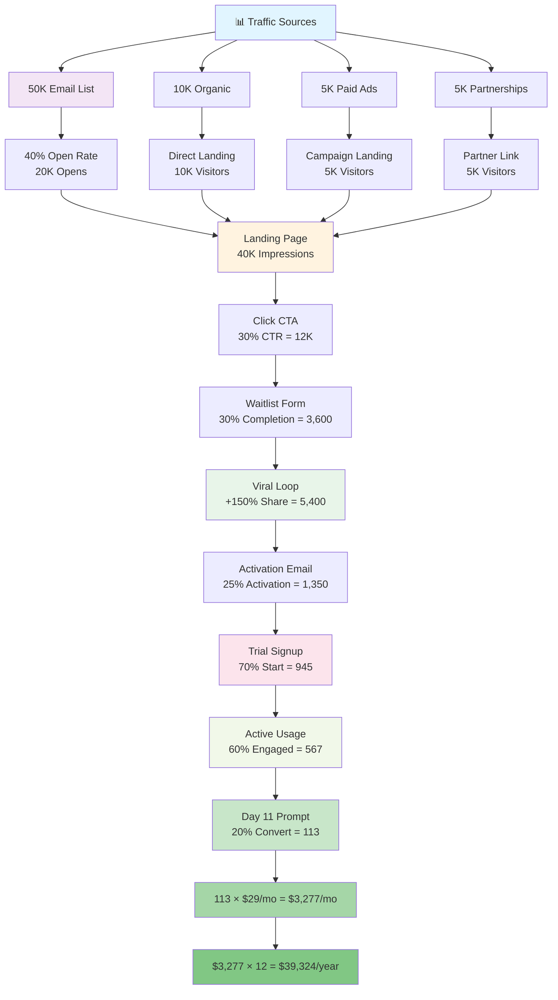
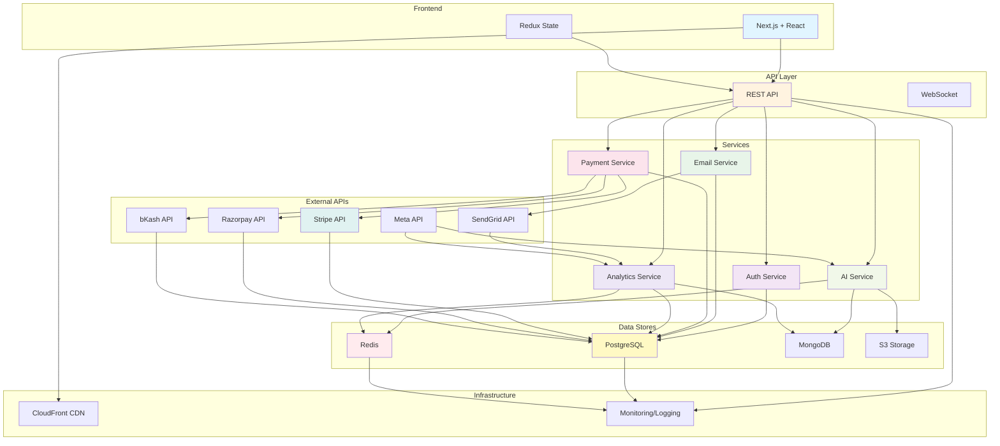
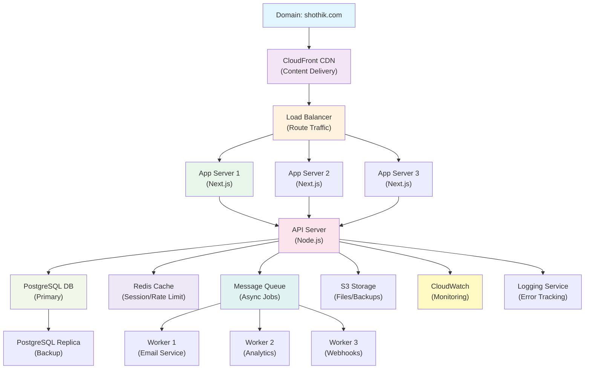
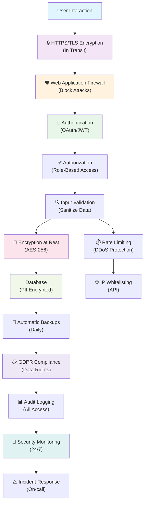
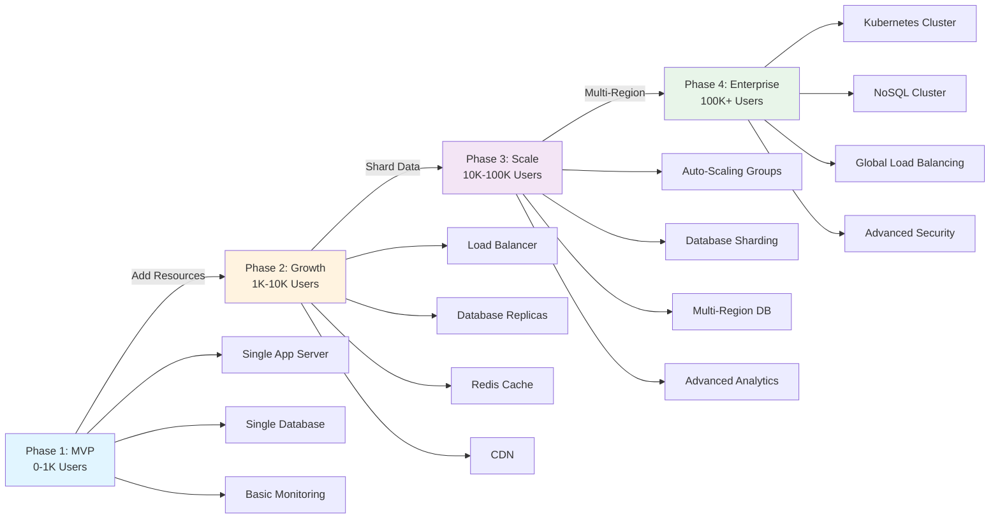

# 🏗️ SHOTHIK 2.0 - COMPLETE ARCHITECTURE BLUEPRINT

**Document Type:** Full system architecture & process flows  
**Date:** October 27, 2025  
**Status:** ✅ Complete  
**Purpose:** Visual guide to all systems, integrations, and data flows

---

## 1. MASTER ARCHITECTURE DIAGRAM

### Complete End-to-End System Flow

---

## 2. LAYERED ARCHITECTURE

### Business Logic Layers

---

## 3. PAYMENT FLOW ARCHITECTURE

### Multi-Region Payment Processing

---

## 4. EMAIL WORKFLOW ARCHITECTURE

### Complete Email Marketing Automation

---

## 5. USER JOURNEY MAPPING

### Complete User Lifecycle

```mermaid
graph LR
    A["👤 Anonymous User<br/>Email List"]

    A -->|Email Click| B["🏠 Landing Page<br/>Discovery"]

    B -->|Form Submit| C["⏱️ Waitlist<br/>Engagement"]

    C -->|Activation| D["🔐 Trial User<br/>Setup"]

    D -->|Create Project| E["🤖 Active Trialer<br/>Usage"]

    E -->|Day 11 Prompt| F{"💭 Decision Point"}

    F -->|Convert| G["💳 Paid Customer<br/>Month 1"]
    F -->|Decline| H["❌ Churned<br/>Re-engagement"]

    G -->|30 Days| I["📈 Active Pro<br/>Month 1+"]

    I -->|Usage Tracking| J{"📊 Engagement Check"}

    J -->|High Usage| K["🎯 Upsell Target<br/>Pro Upgrade"]
    J -->|Medium Usage| L["📧 Engagement Nurture<br/>Content Emails"]
    J -->|Low Usage| M["⚠️ Churn Risk<br/>Re-engagement"]

    K -->|Upgrade| N["💎 Pro Customer<br/>Higher LTV"]
    L -->|Continue| O["📊 Stable Customer<br/>Retention"]
    M -->|Engagement| P["🔄 Reactivated<br/>Back to Active"]
    M -->|No Action| Q["❌ Churned<br/>Win-back Attempt"]

    H -->|Waitlist Again| C
    H -->|New Campaign| A

    Q -->|Email Campaign| A
    Q -->|No Response| R["❌ Lost Customer"]

    N --> S["🌟 Ambassador<br/>Referral Program"]
    O --> S
    P --> S

    S -->|Active Referrals| T["👥 Viral Growth<br/>New Users"]

    T --> A

    style A fill:#e1f5ff,stroke:#01579b,stroke-width:2px
    style B fill:#fff3e0,stroke:#e65100,stroke-width:2px
    style C fill:#f3e5f5,stroke:#4a148c,stroke-width:2px
    style D fill:#e8f5e9,stroke:#1b5e20,stroke-width:2px
    style E fill:#fce4ec,stroke:#880e4f,stroke-width:2px
    style F fill:#fff9c4,stroke:#f57f17,stroke-width:2px
    style G fill:#c8e6c9,stroke:#1b5e20,stroke-width:2px
    style H fill:#ffcdd2,stroke:#b71c1c,stroke-width:2px
    style I fill:#a5d6a7,stroke:#1b5e20,stroke-width:2px
    style K fill:#81c784,stroke:#2e7d32,stroke-width:2px
    style N fill:#66bb6a,stroke:#1b5e20,stroke-width:2px
    style R fill:#ef5350,stroke:#b71c1c,stroke-width:2px
    style S fill:#d1c4e9,stroke:#512da8,stroke-width:2px
```

---

## 6. CONVERSION FUNNEL WITH ARCHITECTURE

### Technical Implementation of Conversion Funnel

---

## 7. TECH STACK INTEGRATION MAP

### How Systems Communicate

---

## 8. DEPLOYMENT ARCHITECTURE

### Cloud Infrastructure Setup

---

## 9. SECURITY & COMPLIANCE ARCHITECTURE

### Data Protection & Compliance Layers

---

## 10. SCALING STRATEGY

### Growth-Ready Architecture

---

## SUMMARY

This architecture blueprint provides:

✅ **End-to-end user journey** - From discovery to ambassador  
✅ **Multi-layer architecture** - Frontend to infrastructure  
✅ **Payment processing** - Multi-region, multi-provider setup  
✅ **Email automation** - Complete workflow with triggers  
✅ **Data flows** - How information moves through system  
✅ **Security & compliance** - GDPR, encryption, audit trails  
✅ **Scaling strategy** - Growth-ready infrastructure  
✅ **Tech integration** - All systems communicating seamlessly

**Status:** ✅ Ready for implementation  
**Owner:** Engineering/Infrastructure team  
**Last Updated:** October 27, 2025
